# 🌍 Silver Path
### Local Tourist Day-Visit Planner and Information System

**Academic Project | Faculty of Information Technology (BIT) | University of Moratuwa**
**Student: Achintha Bandara | Registration No: E2320235**

---

## 📌 Overview

Silver Path is a full-stack MERN (MongoDB, Express, React, Node.js) web application built to promote local tourism in the **Rideegama region, Sri Lanka**.

It provides a centralized platform for discovering and managing tourist destinations within a **25 km radius**. Users can explore locations, view detailed information, and plan efficient one-day visits.

---

## 🎯 Objectives

- **Centralized Information**: Provide reliable and up-to-date tourist data
- **Interactive Map** — Leaflet.js map with category markers and 25 km radius overlay
- **Efficient Planning**: Enable users to explore destinations within a 25 km radius 
- **Real Road Routing** — OSRM integration for actual driving directions 
- **Itinerary Support**: Assist in one-day visit planning
- **Content Management**: Allow admins to manage destinations securely

---

## 🏗️ System Architecture

The application follows **MVC (Model-View-Controller)** architecture:

- **Frontend**: React.js SPA with Tailwind CSS
- **Backend**: Node.js + Express.js REST API
- **Database**: MongoDB Atlas
- **Authentication**: JWT-based admin authentication
- **Media**: Cloudinary for image storage

### 🔄 System Flow

User/Admin → React Frontend (Vite) → Express.js REST API → MongoDB Atlas ←→ Cloudinary (images) ←→ OSRM (road routing)

---

## ⚙️ Core Features

### 🧭 User Features
- Browse and explore tourist destinations
- Search and filter by category
- View detailed information including description, facilities, and travel tips
- Interactive map using Leaflet
- One-day visit planning

### 🔐 Admin Features
- Secret URL key protection (hidden admin login page)
- Secure login using JWT authentication
- Add, update, and delete destinations with full CRUD
- Upload and manage destination images

### ⚡ Technical Highlights
- Geospatial validation within a 25 km radius
- Responsive design for mobile and desktop
- Dynamic data fetching and filtering

---

## 🧰 Tech Stack

| Layer | Technology |
|---|---|
| Frontend | React 18, React Router DOM, Tailwind CSS, DaisyUI |
| UI Libraries | React Icons, React Hot Toast, SweetAlert2 |
| Maps | Leaflet.js, React-Leaflet, OpenStreetMap, OSRM |
| Backend | Node.js v18+, Express.js |
| Database | MongoDB Atlas, Mongoose ODM |
| Authentication | JWT (24h expiry), bcrypt.js (cost factor 10) |
| Media Storage | Cloudinary, Multer, multer-storage-cloudinary |
| Security | express-rate-limit, Admin access key middleware |
| Build Tool | Vite |

---

## 🚀 Installation and Setup

### 🔧 Prerequisites
- Node.js v18 or higher
- MongoDB Atlas account
- Cloudinary account

### 📁 1. Clone Repository
```bash
git clone https://github.com/Achintha-Dev/silver-path.git
cd SilverPath
```

### 🔐 2. Environment Variables
Create a .env file inside the /server directory:


```env
PORT=5000
MONGO_URI=your_mongodb_atlas_connection_string
JWT_SECRET=your_jwt_secret_key
ADMIN_ACCESS_KEY=your_admin_secret_key
NODE_ENV=development
CLIENT_URL=http://localhost:5173

CLOUDINARY_CLOUD_NAME=your_cloudinary_cloud_name
CLOUDINARY_API_KEY=your_cloudinary_api_key
CLOUDINARY_API_SECRET=your_cloudinary_api_secret
```
You can use .env.example as a template.

### ▶️ 3. Run Backend

```bash
cd server
npm install
npm run dev
```

Server runs on: `http://localhost:5000`

### ▶️ 4. Seed Admin Account (First time only)

```bash
cd server
node src/config/seedAdmin.js
```

This creates the default admin account.

### ▶️ 5. Run Frontend

```bash
cd client
npm install
npm run dev
```

Frontend runs on: `http://localhost:5173`

---

## 🔑 Access Information

### Tourist Interface
- URL: http://localhost:5173##

### Admin Panel
- URL:      http://localhost:5173/admin/login?key=YOUR_ADMIN_ACCESS_KEY
- Email:    admin@silverpath.com
- Password: Admin@12345

> ⚠️ The admin login page is intentionally hidden. Visiting
> `/admin/login` without the correct `?key=` parameter
> redirects to the home page for security.

---

## 📂 Project Structure

```
silver-path/
├── client/                   # React frontend (Vite)
│   ├── src/
│   │   ├── assets/           # Static assets (video background)
│   │   ├── components/
│   │   │   ├── admin/             # Admin components (Layout, GlassySelect)
│   │   │   └── user/              # Tourist components
│   │   │       ├── destinations/  # Destination list components
│   │   │       ├── map/           # Map components
│   │   │       └── planner/       # Planner + tab components
│   │   ├── hooks/            # Custom hooks (usePlannerStorage, useUserLocation)
│   │   ├── pages/
│   │   │   ├── admin/        # Admin pages
│   │   │   └── user/         # Tourist pages
│   │   └── utils/            # API client, distance calculations
│   ├── package.json
│   └── vite.config.js
│
├── server/                   # Express.js backend
│   ├── src/
│   │   ├── config/           # DB connection, Cloudinary config, seedAdmin
│   │   ├── controllers/      # Route handlers
│   │   ├── middleware/       # Auth, admin access, rate limiter
│   │   ├── models/           # Mongoose schemas (Destination, Admin)
│   │   └── routes/           # API routes
│   ├── server.js             # Entry point
│   └── package.json
│
├── screenshots/              # Project screenshots
├── README.md
└── .env.example
```

---

## 🗺️ API Endpoints

### Public Routes
| Method | Endpoint | Description |
|---|---|---|
| GET | `/api/destinations` | Get all destinations (with filters) |
| GET | `/api/destinations/:id` | Get single destination |
| GET | `/api/destinations/:id/rating` | Get destination rating |
| POST | `/api/destinations/:id/rate` | Rate a destination |
| GET | `/api/auth/verify-access` | Verify admin secret key |
| POST | `/api/auth/login` | Admin login |

### Protected Routes (Admin)
| Method | Endpoint | Description |
|---|---|---|
| POST | `/api/destinations` | Create destination |
| PUT | `/api/destinations/:id` | Update destination |
| DELETE | `/api/destinations/:id` | Delete destination |
| POST | `/api/destinations/:id/images` | Add images |
| POST | `/api/destinations/:id/images/delete` | Delete single image |
| GET | `/api/auth/me` | Get current admin |
| POST | `/api/auth/logout` | Logout |

---

## 🧪 Testing
Functional testing was performed using **Postman** for API endpoints and **manual browser testing** across Chrome, Firefox, Edge, and Safari.

Test coverage includes:
- All CRUD operations for destinations
- Image upload and deletion (Cloudinary sync)
- Admin authentication and JWT validation
- Secret key protection and rate limiting
- Category and distance filtering
- Visit planner route optimization
- Star rating system
- Responsive layout on mobile devices

---

## 📸 Screenshots

### Home Page
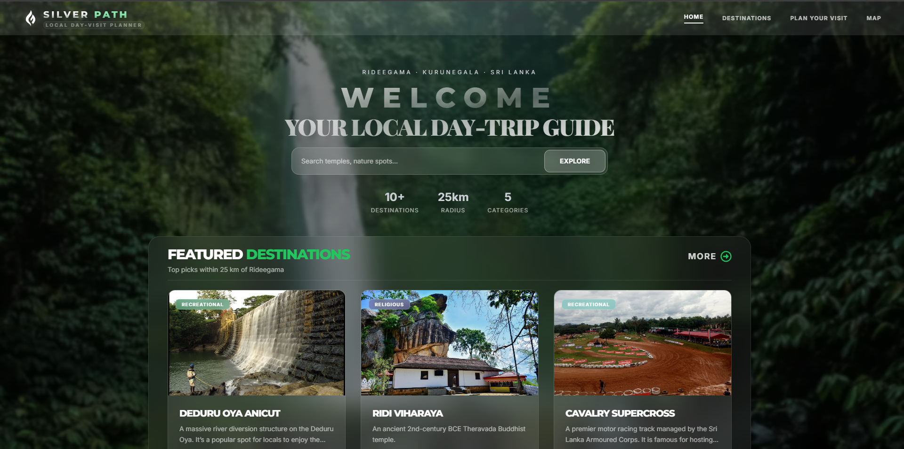
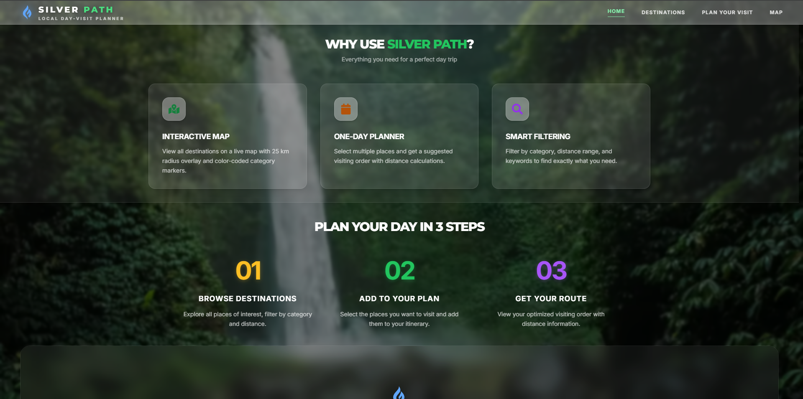
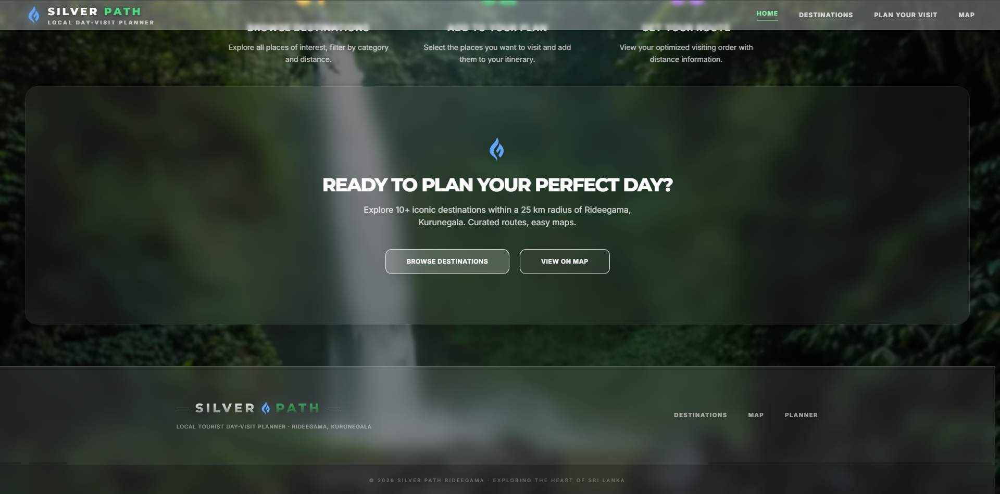
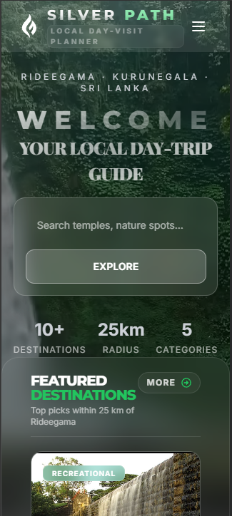

### Destinations Page
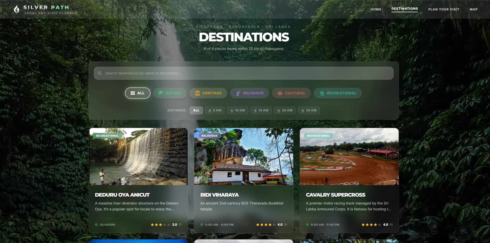
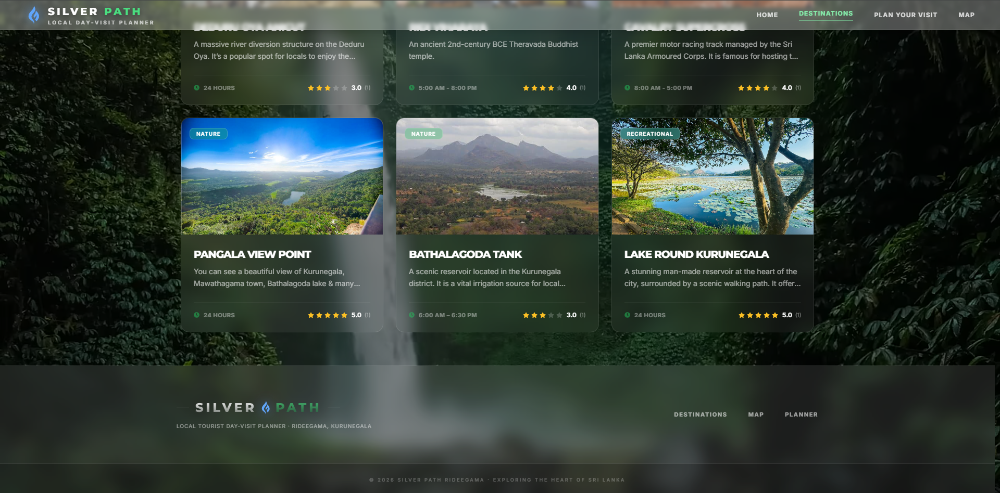
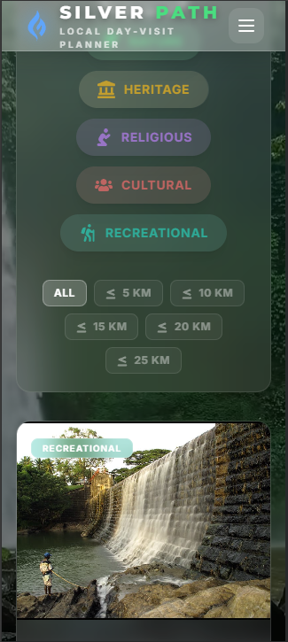

### Map View
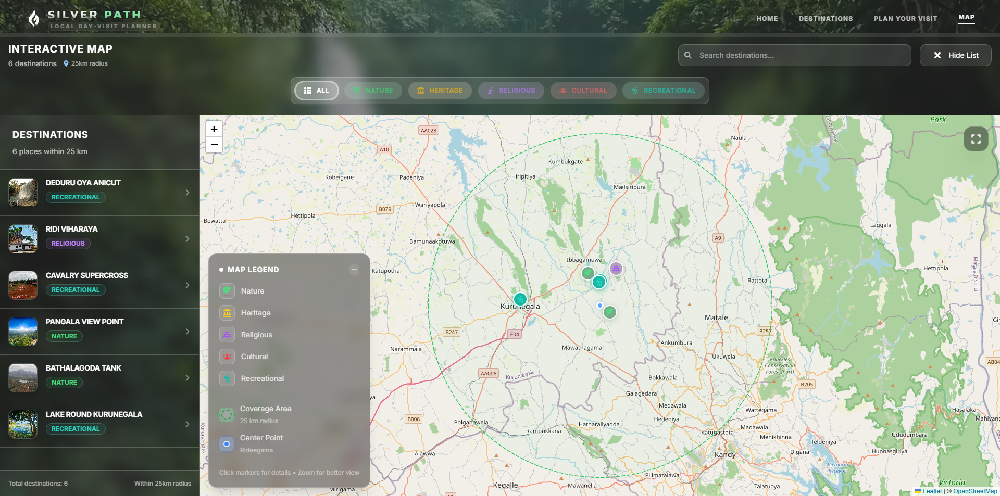
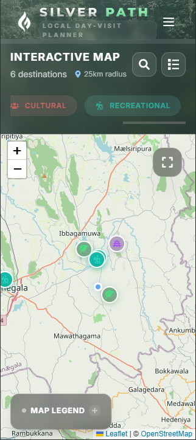

### Plan Visit Page
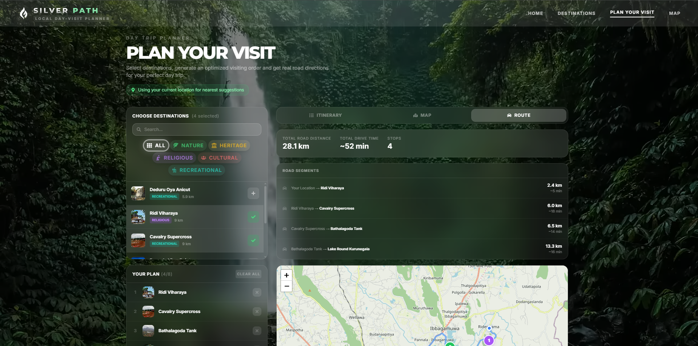

### Admin Login Page
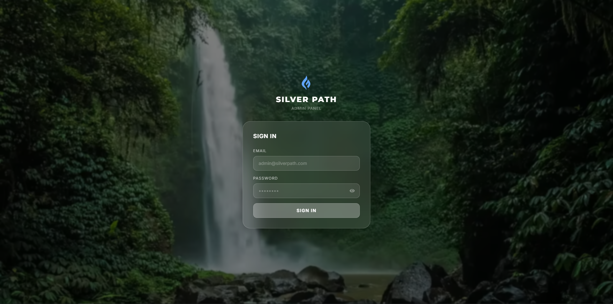

### Admin Dashboard
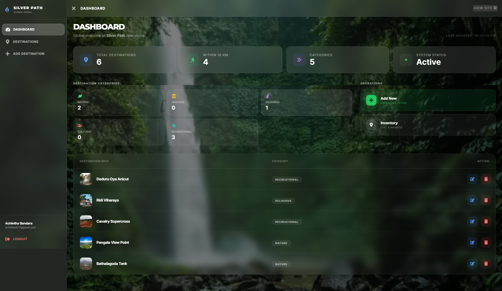
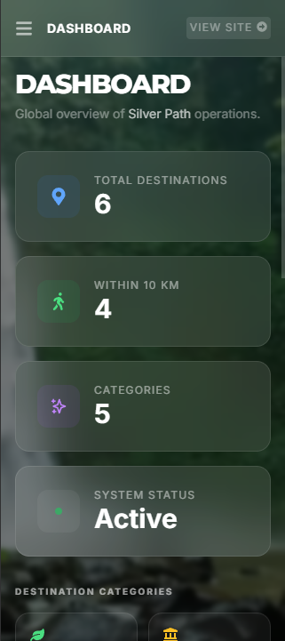

### Admin Add Destination
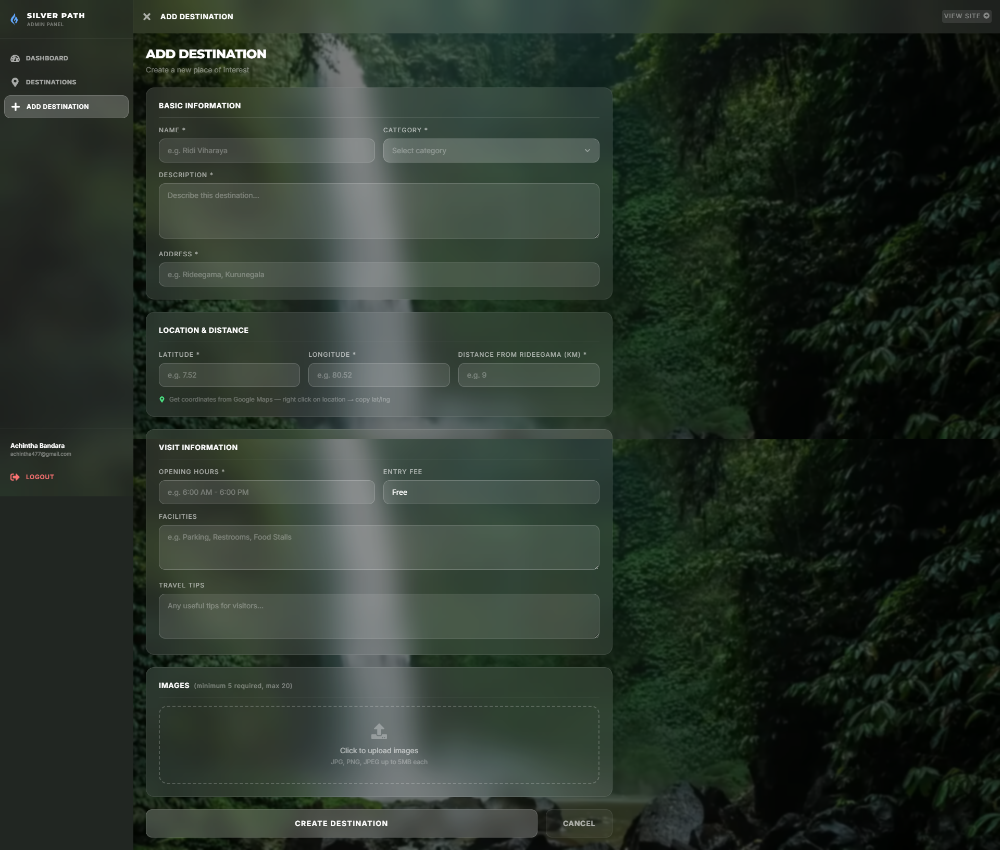
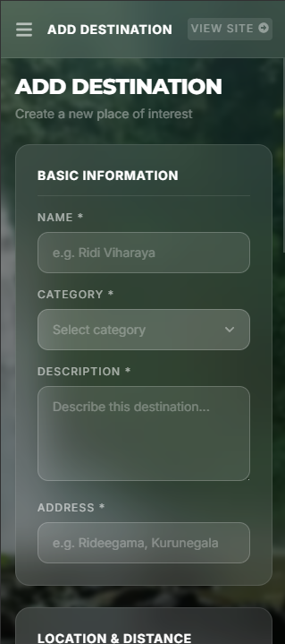

### Admin Edit Destination
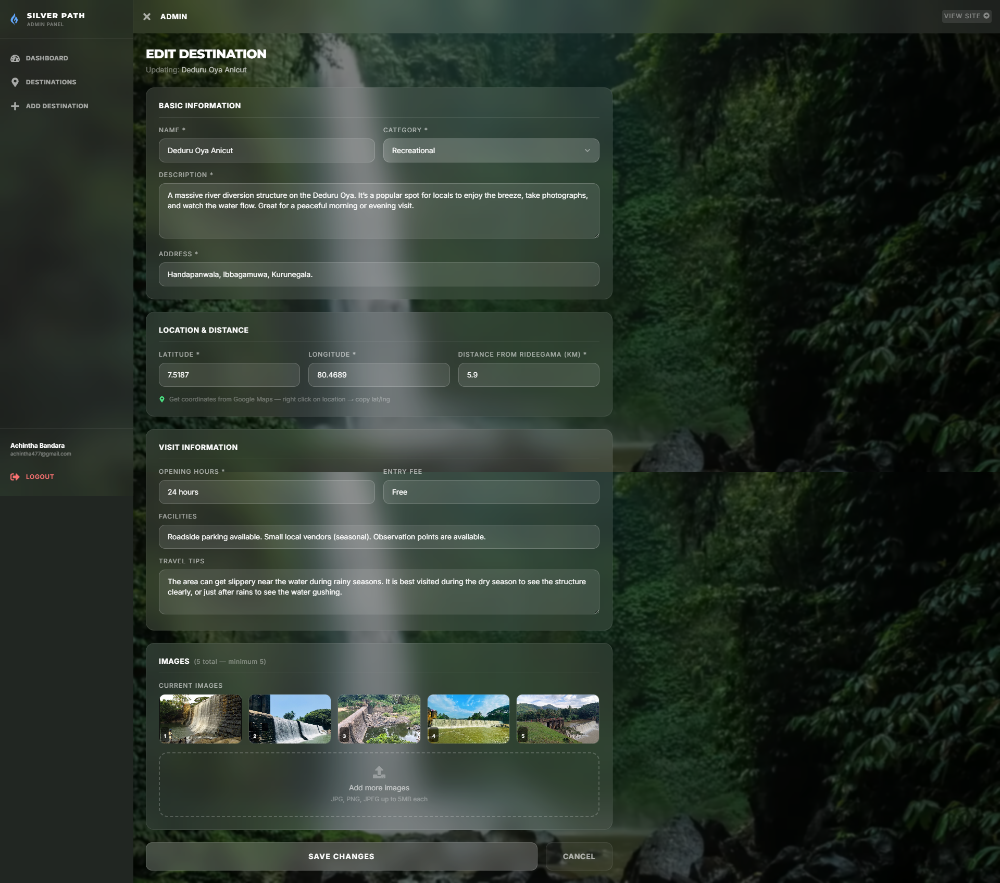

---

## Author

| Field | Details |
|---|---|
| Name | Achintha Bandara |
| Registration No | E2320235 |
| GitHub | https://github.com/Achintha-Dev |
| Degree Program | Bachelor of Information Technology (BIT) |
| University |University of Moratuwa, Sri Lanka |
| Module | ITE2953 - Programming Group Project 25S1 |

---

## Live Demo
-- coming soon.

---

## Badges
[](https://react.dev)
[](https://nodejs.org)
[](https://expressjs.com)
[](https://mongodb.com)
[](https://tailwindcss.com)
[](https://cloudinary.com)
[](https://leafletjs.com)
[](#)