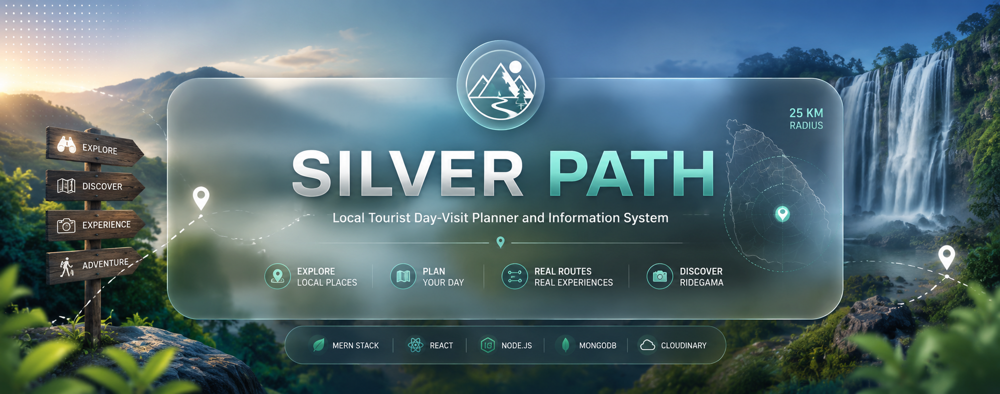
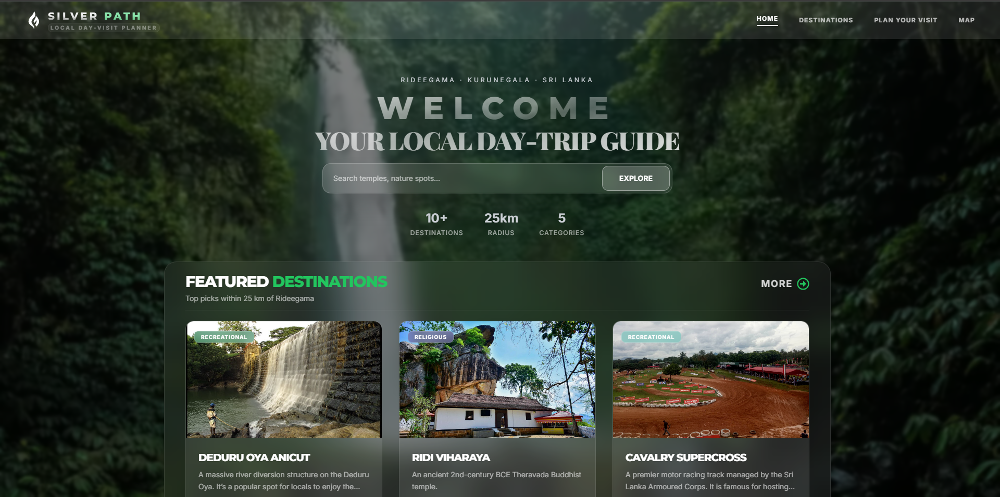
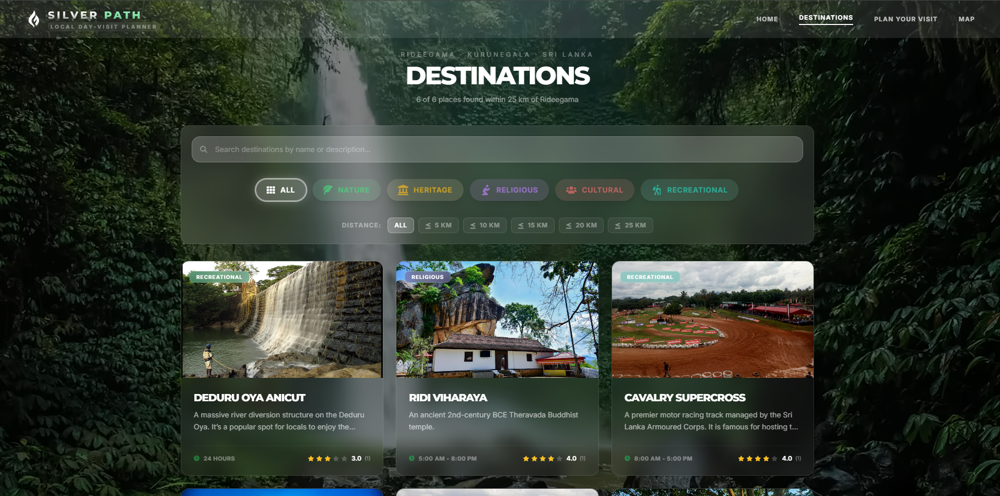
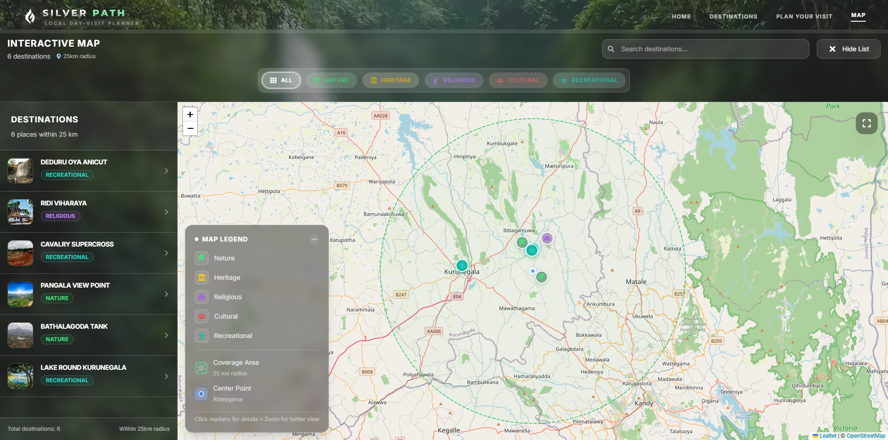
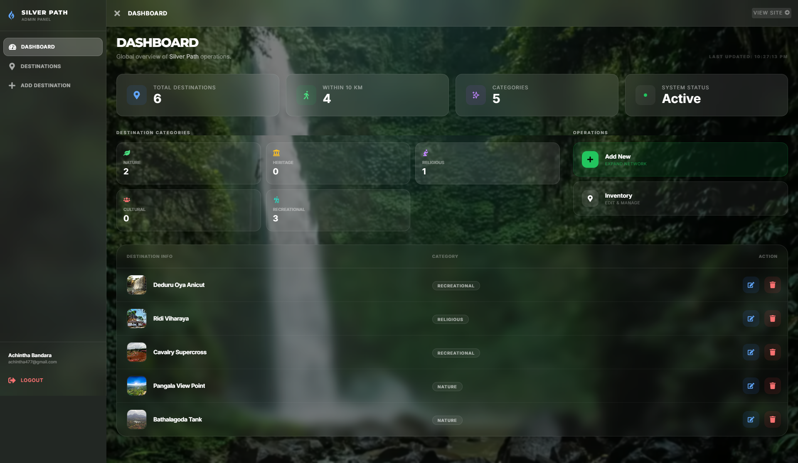

# 🌍 Silver Path
<p align="center">
    <a href="https://github.com/Achintha-Dev/silver-path" target="_blank">
        
    </a>
</p>

<p align="center">
  
  
  
  
  
  
  
  

  <a src='/LICENSE'>
    
  </a>

  
  
  
  <a href="https://silver-path-five.vercel.app">
    
  </a>
</p>

<p align="center">
  
  
</p>

### Local Tourist Day-Visit Planner and Information System
> 🗺️ Discover, plan, and explore tourist destinations within a 25 km radius of Rideegama, Sri Lanka.

**Academic Project | Faculty of Information Technology (BIT) | University of Moratuwa**


[Live Demo](https://silver-path-five.vercel.app/) • [Features](#️-key-featuresfeatures) • [Installation](#-installation-and-setup) • [API](#️-api-endpoints)

## Table of Contents

- [Overview](#-overview)
- [Features](#️-key-features)
- [Screenshots](#-screenshots)
- [Architecture](#️-system-architecture)
- [Project Structure](#-project-structure)
- [Tech Stack](#-tech-stack)
- [Installation](#-installation-and-setup)
- [API Endpoints](#️-api-endpoints)
- [Security](#-security)
- [Testing](#-testing)
- [Future Improvements](#-future-improvements)
- [Deployment](#️-deployment)
- [Author](#author)
- [License](#license)

## 📌 Overview

Silver Path is a full-stack MERN (MongoDB, Express, React, Node.js) web application built to promote local tourism in the **Rideegama region, Sri Lanka**.

It provides a centralized platform for discovering and managing tourist destinations within a **25 km radius**. Users can explore locations, view detailed information, and plan efficient one-day visits.

### Project Objectives

- Promote local tourism in Rideegama.
- Provide destination discovery and route planning.
- Centralize tourist information.
- Support destination management through an admin dashboard.

## ⚙️ Key Features

### 🧭 User Features
- Browse and explore tourist destinations.
- Search and filter by category.
- View detailed information including description, facilities, and travel tips.
- Interactive map using Leaflet.
- One-day visit planning.

### 🔐 Admin Features
- Secret URL key protection (hidden admin login page).
- Secure login using JWT authentication.
- Add, update, and delete destinations with full CRUD.
- Upload and manage destination images.

### ⚡ Technical Highlights
- Geospatial validation within a 25 km radius.
- OSRM (Open Source Routing Machine) route optimization.
- Responsive design for mobile and desktop.
- Dynamic data fetching and filtering.
- Cloudinary image storage.

## 📸 Screenshots

### Home Page
<p align="center">
  
</p>


### Destination Explorer
<p align="center">
  
</p>


### Interactive Map
<p align="center">
  
</p>

### Admin Dashboard
<p align="center">
  
</p>

## 🏗️ System Architecture

The application follows **MVC (Model-View-Controller)** architecture:

- **Frontend**: React.js SPA with Tailwind CSS
- **Backend**: Node.js + Express.js REST API
- **Database**: MongoDB Atlas
- **Authentication**: JWT-based admin authentication
- **Media**: Cloudinary for image storage

### 🔄 System Flow

User/Admin → React Frontend (Vite) → Express.js REST API → MongoDB Atlas ←→ Cloudinary (images) ←→ OSRM (road routing)

```
                ┌──────────────┐
                │ React Client │
                └──────┬───────┘
                       │
                       ▼
                ┌──────────────┐
                │ Express API  │
                └──────┬───────┘
                       │
       ┌───────────────┼───────────────┐
       │               │               │
       ▼               ▼               ▼
┌──────────────┐ ┌──────────────┐ ┌──────────────┐
│ MongoDB Atlas│ │  Cloudinary  │ │     OSRM     │
└──────────────┘ └──────────────┘ └──────────────┘

```

## 📂 Project Structure

```
silver-path/
├── client/                   # React frontend (Vite)
│   ├── src/
│   │   ├── assets/           # Static assets (video background)
│   │   ├── components/
│   │   │   ├── admin/             # Admin components (Layout, GlassySelect)
│   │   │   └── user/              # Tourist components
│   │   │       ├── destinations/  # Destination list components
│   │   │       ├── map/           # Map components
│   │   │       └── planner/       # Planner + tab components
│   │   ├── hooks/            # Custom hooks (usePlannerStorage, useUserLocation)
│   │   ├── pages/
│   │   │   ├── admin/        # Admin pages
│   │   │   └── user/         # Tourist pages
│   │   └── utils/            # API client, distance calculations
│   ├── package.json
│   └── vite.config.js
│
├── server/                   # Express.js backend
│   ├── src/
│   │   ├── config/           # DB connection, Cloudinary config, seedAdmin
│   │   ├── controllers/      # Route handlers
│   │   ├── middleware/       # Auth, admin access, rate limiter
│   │   ├── models/           # Mongoose schemas (Destination, Admin)
│   │   └── routes/           # API routes
│   ├── server.js             # Entry point
│   └── package.json
│
├── screenshots/              # Project screenshots
├── README.md
└── .env.example
```

---


## 🧰 Tech Stack

| Layer | Technology |
|---|---|
| Frontend | React 18, React Router DOM, Tailwind CSS, DaisyUI |
| UI Libraries | React Icons, React Hot Toast, SweetAlert2 |
| Maps | Leaflet.js, React-Leaflet, OpenStreetMap, OSRM |
| Backend | Node.js v18+, Express.js |
| Database | MongoDB Atlas, Mongoose ODM |
| Authentication | JWT (24h expiry), bcrypt.js (cost factor 10) |
| Media Storage | Cloudinary, Multer, multer-storage-cloudinary |
| Security | express-rate-limit, Admin access key middleware |
| Build Tool | Vite |

---

## 🚀 Installation and Setup

### 🔧 Prerequisites
- Node.js v18 or higher
- MongoDB Atlas account
- Cloudinary account

### 📁 1. Clone Repository
```bash
git clone https://github.com/Achintha-Dev/silver-path.git
cd silver-path
```

### 🔐 2. Environment Variables
Create a .env file inside the /server directory:


```env
PORT=5000
MONGO_URI=your_mongodb_atlas_connection_string
JWT_SECRET=your_jwt_secret_key
ADMIN_ACCESS_KEY=your_admin_secret_key
NODE_ENV=development
CLIENT_URL=http://localhost:5173

CLOUDINARY_CLOUD_NAME=your_cloudinary_cloud_name
CLOUDINARY_API_KEY=your_cloudinary_api_key
CLOUDINARY_API_SECRET=your_cloudinary_api_secret
```
You can use .env.example as a template.

### ▶️ 3. Run Backend

```bash
cd server
npm install
npm run dev
```

Server runs on: `http://localhost:5000`

### ▶️ 4. Seed Admin Account (First time only)

```bash
cd server
node src/config/seedAdmin.js
```

This creates the default admin account.

### ▶️ 5. Run Frontend

```bash
cd client
npm install
npm run dev
```

Frontend runs on: `http://localhost:5173`

---

## 🔑 Access Information

### User Interface
- URL: http://localhost:5173

### Admin Panel
- URL: http://localhost:5173/admin/login?key=YOUR_ADMIN_ACCESS_KEY
- The admin account is generated using the seed script.
- Configure your own credentials before deployment.

> ⚠️ The admin login page is intentionally hidden. Visiting
> `/admin/login` without the correct `?key=` parameter
> redirects to the home page for security.

---

## 🗺️ API Endpoints

### Public Routes
| Method | Endpoint | Description |
|---|---|---|
| GET | `/api/destinations` | Get all destinations (with filters) |
| GET | `/api/destinations/:id` | Get single destination |
| GET | `/api/destinations/:id/rating` | Get destination rating |
| POST | `/api/destinations/:id/rate` | Rate a destination |
| GET | `/api/auth/verify-access` | Verify admin secret key |
| POST | `/api/auth/login` | Admin login |

### Protected Routes (Admin)
| Method | Endpoint | Description |
|---|---|---|
| POST | `/api/destinations` | Create destination |
| PUT | `/api/destinations/:id` | Update destination |
| DELETE | `/api/destinations/:id` | Delete destination |
| POST | `/api/destinations/:id/images` | Add images |
| POST | `/api/destinations/:id/images/delete` | Delete single image |
| GET | `/api/auth/me` | Get current admin |
| POST | `/api/auth/logout` | Logout |

---

## 🔒 Security

- JWT Authentication
- Password Hashing (bcrypt)
- Protected Routes
- Rate Limiting
- Environment Variable Protection
- Admin Access Key Validation

---

## 🧪 Testing
Functional testing was performed using **Postman** for API endpoints and **manual browser testing** across Chrome, Firefox, Edge, and Safari.

Test coverage includes:
- All CRUD operations for destinations
- Image upload and deletion (Cloudinary sync)
- Admin authentication and JWT validation
- Secret key protection and rate limiting
- Category and distance filtering
- Visit planner route optimization
- Star rating system
- Responsive layout on mobile devices

---

## 🚀 Future Improvements

- User accounts
- Personalized recommendations
- AI-powered itinerary generation
- Multi-language support
- Progressive Web App (PWA)
- Tourist review system
- Offline map support

---

## ☁️ Deployment

| Service | Platform |
|----------|----------|
| Frontend | Vercel |
| Backend | Render |
| Database | MongoDB Atlas |
| Media Storage | Cloudinary |

### Live Application
https://silver-path-five.vercel.app

---

## Author

| Field | Details |
|---|---|
| Name | Achintha Bandara |
| GitHub | https://github.com/Achintha-Dev |

## Academic Information
| Field | Details |
|---|---|
| Registration No | E2320235 |
| Degree Program | Bachelor of Information Technology (BIT) |
| University |University of Moratuwa, Sri Lanka |
| Module | ITE2953 - Programming Group Project 25S1 |
| Semester | 25S1 |

---
## License

This project is licensed for academic and educational purposes only.
See the [LICENSE](LICENSE) file for details.

[Go back to up ⬆](#-silver-path)